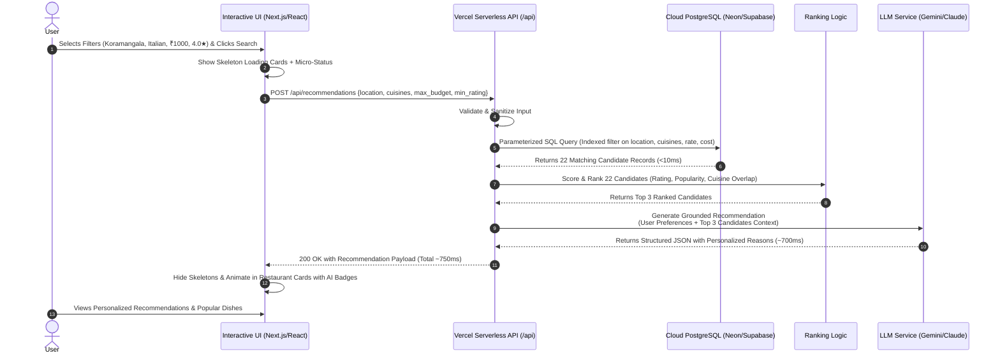

# Production-Ready System Architecture: AI-Powered Restaurant Recommendation Service

## 1. Executive Summary & Objective

This document defines the production-ready system architecture for an **AI-Powered Restaurant Recommendation Service** featuring a modern, **interactive Web UI** and a **Vercel serverless deployment**.

The system enables users to input dining preferences (budget/price range, location, rating floor, and desired cuisines) through a responsive interface, filters and ranks candidate restaurants from the Zomato Bangalore dataset ([`ManikaSaini/zomato-restaurant-recommendation`](https://huggingface.co/datasets/ManikaSaini/zomato-restaurant-recommendation) on Hugging Face), and leverages a Large Language Model (LLM) to generate personalized, grounded rationales explaining why each recommended venue matches the user's specific request.

The design adheres to a **Two-Stage Retrieval & Synthesis Pattern** (Filter $\rightarrow$ Rank $\rightarrow$ Reason) to ensure:
- **Interactive, User-Centric Experience**: Dynamic UI with auto-complete, multi-select cuisine pills, budget sliders, loading skeletons, and rich recommendation cards with AI badges.
- **Low Latency & High Speed**: Sub-second end-to-end response times through indexed relational filtering.
- **Cost Efficiency**: Minimizing LLM token consumption by passing only top pre-ranked candidate restaurants.
- **Zero Hallucination**: Strict grounding constraints preventing the LLM from inventing restaurants, menus, or pricing.
- **Serverless Vercel Deployment**: Zero-devops, edge-distributed frontend and serverless API connected to a cloud-managed PostgreSQL database (e.g., Neon / Supabase).

---

## 2. High-Level Architecture Diagram

```mermaid
flowchart TD
    subgraph Data_Preparation ["Offline Data Preparation (One-Time / Batch ETL)"]
        HF[("Hugging Face Hub\nManikaSaini/zomato-restaurant-recommendation")] --> Ingest[Data Ingestion Script]
        Ingest --> CleanETL["Data Processing & Normalization\n(Pandas / Polars)"]
        CleanETL --> CloudDB[("Cloud PostgreSQL\n(Neon Serverless / Supabase)\nwith GIN & Trigram Indexes")]
    end

    subgraph Vercel_Platform ["Vercel Serverless Platform"]
        subgraph Frontend_App ["Interactive Web Application (Next.js / React)"]
            UI_Form["Preference Input Form\n• Location Autocomplete\n• Budget Slider (₹)\n• Star Rating Selector\n• Cuisine Pills & Vibe Note"]
            UI_State["State & Feedback Manager\n• Loading Skeletons\n• Filter Relaxation Prompts"]
            UI_Cards["Interactive Results View\n• Restaurant Cards\n• AI Match Rationale Badge\n• Popular Dishes & Price Tags"]
        end

        subgraph Serverless_API ["Vercel Serverless Function Layer (/api/recommendations)"]
            PrefValidator["Phase 3: Preference Normalizer\n(Validation & Query Formulation)"]
            RetrievalEngine["Phase 4A: Retrieval Engine\n(SQL Hard & Soft Filter via Connection Pool)"]
            RankingEngine["Phase 4B: Heuristic Ranking Engine\n(Multi-Attribute Scoring)"]
            LLMOrchestrator["Phase 5: LLM Reasoning Layer\n(Context Grounding + Structured Prompt)"]
        end
    end

    subgraph External_Services ["Managed External Services"]
        LLMProvider["LLM API\n(Google Gemini 2.5 Flash / Claude 3.5 Sonnet)"]
        CloudDB
    end

    UI_Form -->|User Submits Preferences| UI_State
    UI_State -->|HTTP POST Request| PrefValidator
    PrefValidator --> RetrievalEngine
    CloudDB -.->|Fast Indexed SQL Scan (<10ms)| RetrievalEngine
    RetrievalEngine -->|Top 20-30 Candidates| RankingEngine
    RankingEngine -->|Top 3-5 Ranked Candidates| LLMOrchestrator
    LLMOrchestrator -->|Grounded Prompt| LLMProvider
    LLMProvider -->|Strict JSON Schema Response| LLMOrchestrator
    LLMOrchestrator -->|Standardized Recommendation Payload| UI_Cards

    classDef primary fill:#2563eb,stroke:#1d4ed8,stroke-width:2px,color:#fff;
    classDef storage fill:#059669,stroke:#047857,stroke-width:2px,color:#fff;
    classDef compute fill:#7c3aed,stroke:#6d28d9,stroke-width:2px,color:#fff;
    classDef ui fill:#0284c7,stroke:#0369a1,stroke-width:2px,color:#fff;

    class UI_Form,UI_State,UI_Cards ui;
    class HF,CloudDB storage;
    class Ingest,CleanETL,PrefValidator,RetrievalEngine,RankingEngine,LLMOrchestrator compute;
    class LLMProvider primary;
```

---

## 3. Core Architectural Distinctions

To ensure system reliability, predictability, and cost control, the architecture strictly segregates the three recommendation responsibilities:

| Responsibility | Component | Mechanism | Operational Justification |
| :--- | :--- | :--- | :--- |
| **1. Dataset Retrieval & Filtering** | Database Layer (`Cloud PostgreSQL`) | SQL `WHERE` clauses, B-Tree indexes (`rate`, `cost`), GIN & Trigram indexes (`cuisines`, `location`). | **Speed & Cost**: Cuts 51,717 records down to 20–30 relevant candidates in <10ms without consuming expensive LLM context tokens. |
| **2. Recommendation & Ranking Logic** | Heuristic Scoring Engine (Serverless API) | Deterministic composite scoring formula combining rating, popularity, cuisine overlap, and price distance. | **Consistency & Control**: Eliminates non-deterministic ordering; ensures transparent, testable, and unbiased candidate selection. |
| **3. Natural Language Reasoning** | LLM Synthesis Layer (`Gemini / Claude`) | Context-grounded synthesis with strict JSON schema and anti-hallucination prompt boundaries. | **Personalization & Engagement**: Translates dry tabular metadata into intuitive, human-centered rationales matching the user's intent. |

---

## 4. Phase-Wise Architecture Breakdown

### Phase 1: Data Ingestion
* **Objective**: Ingest the 51,717 records (~574 MB) from Hugging Face and store them immutably.
* **Source Dataset**: `ManikaSaini/zomato-restaurant-recommendation`
* **Raw Schema Fields**:
  * Identifiers & Metadata: `url`, `address`, `name`, `phone`, `listed_in(type)`, `listed_in(city)`
  * Categorical Attributes: `online_order`, `book_table`, `location`, `rest_type`, `cuisines`
  * Quantitative Attributes: `rate`, `votes`, `approx_cost(for two people)`
  * Textual Context: `dish_liked`, `reviews_list`, `menu_item`
* **Storage Strategy**:
  * An automated local Python script downloads the dataset using `datasets` / `huggingface_hub`.
  * Saved locally as staging Parquet files or directly migrated into the cloud-hosted PostgreSQL database.

---

### Phase 2: Data Processing & Preparation
* **Objective**: Clean messy fields, handle missing values, deduplicate listings, and build query indexes.
* **Cleaning & Normalization Rules**:
  1. **Rating (`rate`)**:
     * Raw: `"4.1/5"`, `"NEW"`, `"-"`, `NaN`.
     * Clean: Parse numeric rating float (`4.1`). For `"NEW"`, `"-"`, or missing, set `rate = NULL` and flag `is_new_restaurant = TRUE`.
  2. **Cost (`approx_cost(for two people)`)**:
     * Raw: `"800"`, `"1,200"`, `NaN`.
     * Clean: Strip commas, cast to integer (`1200`). Impute remaining nulls using median cost of matching `(location, rest_type)`.
  3. **Cuisines (`cuisines`)**:
     * Raw: Comma-delimited text string (e.g., `"North Indian, Chinese, Fast Food"`).
     * Clean: Split into canonicalized, trimmed lowercase arrays (`text[]`), indexed with GIN.
  4. **Location (`location`, `listed_in(city)`)**:
     * Standardize casing and strip whitespace. Maintain both the specific micro-locality (e.g., `"Koramangala 5th Block"`) and the broader cluster (e.g., `"Koramangala"`).
  5. **Deduplication**:
     * The raw dataset contains duplicate restaurant entries because venues are listed across multiple delivery zones (`listed_in(city)`).
     * Deduplicate using a composite key `(name, address)` or `(name, location)`, keeping the record with the highest vote count and aggregating liked dishes.
* **Relational Cloud Storage Schema (PostgreSQL)**:
  ```sql
  CREATE TABLE clean_restaurants (
      id UUID PRIMARY KEY DEFAULT gen_random_uuid(),
      name VARCHAR(255) NOT NULL,
      address TEXT NOT NULL,
      location VARCHAR(100) NOT NULL,
      location_cluster VARCHAR(100) NOT NULL,
      cuisines TEXT[] NOT NULL,
      cost_for_two INT NOT NULL,
      rate NUMERIC(2, 1),
      votes INT DEFAULT 0,
      rest_type VARCHAR(100),
      dish_liked TEXT[],
      sample_reviews TEXT[],
      online_order BOOLEAN DEFAULT FALSE,
      book_table BOOLEAN DEFAULT FALSE,
      is_new BOOLEAN DEFAULT FALSE,
      created_at TIMESTAMP WITH TIME ZONE DEFAULT NOW()
  );

  -- High-Performance Search Indexes
  CREATE INDEX idx_restaurants_location_trgm ON clean_restaurants USING gin (location gin_trgm_ops);
  CREATE INDEX idx_restaurants_cuisines_gin ON clean_restaurants USING gin (cuisines);
  CREATE INDEX idx_restaurants_rate_cost ON clean_restaurants (rate DESC NULLS LAST, cost_for_two ASC);
  ```

---

### Phase 3: User Preference Processing
* **Objective**: Ingest, validate, sanitize, and normalize user inputs submitted from the frontend UI.
* **Input Schema (`UserPreferenceRequest`)**:
  * `location` (string, required): e.g., `"Koramangala"`, `"Indiranagar"`.
  * `price_range` / `max_budget` (int, required): e.g., `1000`.
  * `cuisines` (list of strings, optional): e.g., `["Italian", "Pizza"]`.
  * `min_rating` (float, optional, default: `3.5`): e.g., `4.0`.
  * `vibe_or_notes` (string, optional): e.g., `"rooftop outdoor seating with good music"`.
* **Processing Logic**:
  1. **Sanitization**: Trim whitespace, remove special characters, and lowercase strings.
  2. **Fuzzy Location Resolution**: Match user query against known Bangalore localities to handle misspellings (e.g., `"koramangla"` $\rightarrow$ `"Koramangala"`).
  3. **Structured Mapping**: Translate user criteria into SQL parameters for database execution.

---

### Phase 4: Restaurant Retrieval & Recommendation Engine

This phase operates as a two-stage funnel:

```
[51,717 Processed Restaurants in Cloud DB]
            │
            ▼  (Stage 4A: Fast SQL Filter via DB Indexes)
[Top 20–30 Feasible Candidates]
            │
            ▼  (Stage 4B: Deterministic Scoring & Ranking Algorithm)
[Top 3–5 Ranked Candidates for LLM Prompt]
```

#### Step 4A: Fast Candidate Retrieval (SQL)
Executes an indexed SQL query via connection-pooled database connection:
```sql
SELECT id, name, location, cuisines, cost_for_two, rate, votes, rest_type, dish_liked, sample_reviews
FROM clean_restaurants
WHERE 
    (rate >= :min_rating OR rate IS NULL)
    AND cost_for_two <= :max_budget
    AND (location ILIKE '%' || :location || '%' OR location_cluster ILIKE '%' || :location || '%')
    AND cuisines && :target_cuisines
ORDER BY rate DESC NULLS LAST, votes DESC
LIMIT 30;
```
* **Fallback Relaxation Strategy**: If fewer than 3 candidates match:
  1. Relax cuisine constraint to partial/subset match.
  2. Increase budget limit by +25%.
  3. Lower minimum rating threshold by 0.3.

#### Step 4B: Multi-Factor Heuristic Ranking Engine
Computes a **Composite Match Score ($S$)** between 0.0 and 1.0 for each of the 20–30 retrieved candidates:
$$S = w_{\text{cuisine}} \cdot S_{\text{cuisine}} + w_{\text{rating}} \cdot S_{\text{rating}} + w_{\text{price}} \cdot S_{\text{price}} + w_{\text{pop}} \cdot S_{\text{pop}}$$

* **Weightings**:
  * $w_{\text{cuisine}} = 0.35$: Jaccard similarity between user cuisine list and restaurant cuisine list.
  * $w_{\text{rating}} = 0.30$: Normalized score $\frac{\text{rate}}{5.0}$.
  * $w_{\text{price}} = 0.20$: Proximity score $1.0 - \frac{|\text{cost\_for\_two} - \text{target\_budget}|}{\text{target\_budget}}$ (bounded between 0 and 1).
  * $w_{\text{pop}} = 0.15$: Popularity damping factor $\frac{\log(1 + \text{votes})}{\log(1 + \text{max\_votes})}$.
* **Selection**: The top 3 to 5 highest-scoring candidates are sliced and forwarded to the LLM.

---

### Phase 5: LLM Recommendation Layer
* **Objective**: Generate personalized, clear, and persuasive recommendations explaining *why* each restaurant matches the user's specific request.
* **Strict Anti-Hallucination Guardrails**:
  1. **Closed-World Constraint**: The LLM is instructed never to use external knowledge or invent restaurants, dishes, or prices not provided in the prompt.
  2. **Context Enclosure**: Candidate metadata is enclosed inside explicit XML tags (`<verified_restaurants>...</verified_restaurants>`).
  3. **Strict JSON Schema (Structured Outputs)**: Enforced via model `response_format` (JSON Schema) to guarantee strict response syntax.
* **Prompt Template**:
  ```text
  SYSTEM PROMPT:
  You are an expert culinary concierge. You will receive a user's dining preferences 
  and a verified list of candidate restaurants retrieved from the database.

  CRITICAL CONSTRAINTS:
  1. Only recommend from the provided candidate list. Never invent or recommend external restaurants.
  2. Do not fabricate or alter any restaurant details (price, rating, location, cuisine, dishes).
  3. Base your reasoning exclusively on the provided attributes, popular dishes, and review snippets.
  4. Explain clearly and concisely (2-3 sentences) why each restaurant satisfies the user's specific preferences.

  USER PREFERENCES:
  - Location: {user_location}
  - Desired Cuisines: {user_cuisines}
  - Budget for Two: Up to ₹{user_budget}
  - Minimum Rating: {user_rating}
  - Special Occasion / Notes: {user_notes}

  VERIFIED RESTAURANT CANDIDATES:
  <verified_restaurants>
  {candidate_restaurants_json}
  </verified_restaurants>

  Respond strictly using the required JSON schema.
  ```

---

### Phase 6: Interactive Web UI & API Layer

#### 6A. Interactive Frontend Architecture (Next.js / React)
The user interface is designed to be modern, responsive, and engaging:

1. **Preference Control Panel**:
   * **Location Search**: Autocomplete input with quick-select chips for popular Bangalore dining hubs (`Koramangala`, `Indiranagar`, `HSR Layout`, `Whitefield`, `MG Road`, `Jayanagar`).
   * **Budget Slider**: Interactive dual/single range slider (₹200 to ₹3,000+) showing live "₹ for two" visual indicators.
   * **Star Rating Buttons**: Quick-select pill filters (`Any`, `3.5+ ★`, `4.0+ ★`, `4.5+ ★`).
   * **Cuisine Grid / Pills**: Multi-select badges with emojis (`🍕 Italian`, `🍛 North Indian`, `🥢 Chinese`, `🥘 Biryani`, `🥗 Healthy`, `☕ Cafe`).
   * **Vibe / Occasion Field**: Optional conversational text box (*"cozy corner for a date night"*, *"quick office lunch"*).
   * **Submit Button**: High-visibility call to action (*"Find My Recommendations ✨"*).

2. **Dynamic State & Feedback Management**:
   * **Loading Skeleton State**: Displays animated shimmer cards with real-time micro-status updates:
     - *"Scanning 50,000+ restaurants..."*
     - *"Applying budget & rating filters..."*
     - *"AI generating personalized recommendations..."*
   * **Empty State & Relaxation Prompt**: If zero restaurants match an overly restrictive search, the UI displays one-click relaxation triggers (*"No exact matches under ₹400 in Indiranagar. Click here to search under ₹600 or check nearby Domlur"*).
   * **Error Toast**: Clean visual feedback if the network request fails.

3. **Recommendation Results View**:
   * **Restaurant Card Component**:
     - **Header**: Restaurant Name, Micro-locality (`Koramangala 5th Block`), and Dining Type badge (`Casual Dining`, `Cafe`).
     - **Metrics Row**: Star Rating with vote count badge (`★ 4.4 (1,280)`), Cost for Two tag (`₹900 for two`).
     - **Cuisine Badges**: Clean pill tags (`Italian`, `Pizza`).
     - **AI Recommendation Box**: Distinct visual callout banner with an AI icon displaying the personalized reasoning.
     - **Signature Dishes**: Pills highlighting dishes liked by diners (`Ravioli`, `Bruschetta`, `Tiramisu`).

#### 6B. Serverless API Architecture (Vercel Functions)
* **Route**: `POST /api/recommendations` (Next.js App Router Route Handler or Vercel Serverless Function).
* **Execution Flow**:
  1. Ingests request payload from the frontend.
  2. Runs Pydantic / Zod schema validation.
  3. Executes parameterized query against cloud PostgreSQL using pooled connection (`@neondatabase/serverless` or Python driver with pooling).
  4. Runs the heuristic scoring engine.
  5. Dispatches candidate context to Gemini / Claude via official SDK.
  6. Returns structured JSON to the client.

---

### Phase 7: Output Layer
* **Standardized JSON Response Contract**:
  ```json
  {
    "status": "success",
    "query_summary": {
      "location": "Koramangala",
      "cuisines": ["Italian"],
      "max_budget": 1000,
      "min_rating": 4.0
    },
    "total_candidates_found": 18,
    "recommendations": [
      {
        "restaurant_id": "9b1deb4d-3b7d-4bad-9bdd-2b0d7b3dcb6d",
        "name": "Toscano",
        "location": "Koramangala 5th Block",
        "cuisines": ["Italian", "Pizza", "Desserts"],
        "price_for_two": 900,
        "rating": 4.4,
        "votes": 1280,
        "popular_dishes": ["Ravioli", "Bruschetta", "Tiramisu"],
        "recommendation_reason": "Toscano perfectly matches your ₹1,000 budget while exceeding your 4.0 rating target with a 4.4 rating. Situated right in Koramangala 5th Block, it is celebrated for authentic wood-fired pizzas and homemade ravioli, making it an ideal Italian dining choice."
      }
    ],
    "meta": {
      "execution_time_ms": 745
    }
  }
  ```

---

### Phase 8: Vercel Serverless Deployment & Configuration
* **Deployment Model**:
  * Unified single-repository deployment on **Vercel**.
  * The frontend is built and served via Vercel's Edge Network / CDN for global low latency.
  * The backend API operates as a **Vercel Serverless Function** (`/api/recommendations`), auto-scaling on demand from zero with zero server maintenance.
* **Database Hosting**:
  * **Neon Serverless PostgreSQL** (or Supabase): Provides a free-tier/managed PostgreSQL instance with instant branching and connection pooling (`pgbouncer` built-in), ideal for serverless cold-starts.
  * Ingestion and cleaning scripts (Phases 1 & 2) run once locally or via a one-off migration script to populate the cloud database.
* **Environment Variables in Vercel**:
  * `DATABASE_URL`: Connection pooled URL for Neon/Supabase PostgreSQL.
  * `GEMINI_API_KEY` (or `ANTHROPIC_API_KEY`): API key for LLM inference.
* **Basic Error Handling & Resilience**:
  * Frontend gracefully handles API timeouts with retry prompts.
  * Serverless function implements a 15-second timeout safeguard.
  * If the LLM provider returns an error, the API falls back to generating a template-based recommendation from the top-ranked candidate's database attributes.

---

## 5. End-to-End Request Flow for a Sample Query

### Sample Query Scenario:
> **User Action**: The user selects *"Koramangala"*, picks *"Italian"*, drags the budget slider to *₹1000*, selects *4.0+ Stars*, and clicks *"Find My Recommendations"*.



---

## 6. Technology Stack Matrix

| Component | Selected Technology | Purpose & Rationale |
| :--- | :--- | :--- |
| **Hosting & Deployment** | Vercel Platform | Zero-server setup, automated Git deployments, edge-cached frontend, and serverless API execution. |
| **Frontend Framework** | Next.js (App Router) / React | Modern reactive UI, server-side rendering for instant initial load, seamless integration on Vercel. |
| **Styling & Components** | Tailwind CSS / Vanilla CSS | Sleek, modern design with smooth animations, mobile-first responsive layout, and dark/light support. |
| **Database** | Neon Serverless PostgreSQL / Supabase | Cloud-managed PostgreSQL supporting `pg_trgm`, GIN indexes, and native connection pooling for serverless. |
| **Data Cleaning (Offline)** | Python (Pandas / Polars) | One-time batch script to clean and upload the 574 MB raw Hugging Face dataset to the cloud database. |
| **LLM Engine** | Google Gemini 2.5 Flash / Claude 3.5 Sonnet | Ultra-fast inference (<800ms), highly economical pricing, native strict JSON schema support. |
| **API Transport** | Next.js Route Handlers / Vercel Serverless | Clean, serverless JSON endpoints without managing persistent backend servers. |

---

## 7. Implementation Roadmap & Milestones

1. **Milestone 1: Data Preparation & Cloud DB Setup**:
   - Create a free database instance on Neon or Supabase.
   - Run the local Python ingestion & cleaning script to download `ManikaSaini/zomato-restaurant-recommendation`, clean the data, and populate the cloud PostgreSQL table.
   - Verify GIN and B-Tree indexes.
2. **Milestone 2: Serverless Recommendation Engine**:
   - Implement the SQL retrieval query with fallback relaxation.
   - Implement the heuristic ranking formula.
   - Wire up LLM prompt grounding and structured JSON generation.
3. **Milestone 3: Interactive Frontend Development**:
   - Build the Next.js / React application with the search controls (location autocomplete, budget slider, cuisine pills).
   - Implement loading skeletons and empty state relaxation prompts.
   - Build rich restaurant cards featuring the AI recommendation rationale banner.
4. **Milestone 4: Vercel Deployment**:
   - Configure environment variables (`DATABASE_URL`, `GEMINI_API_KEY`) in the Vercel dashboard.
   - Connect the repository to Vercel and verify live deployment.
