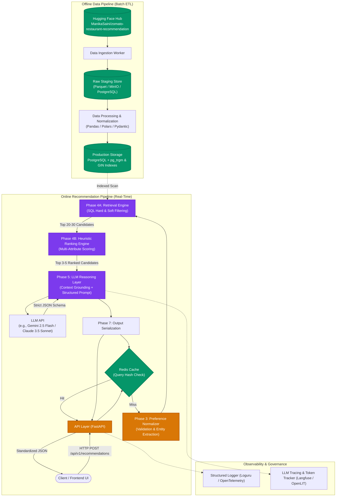
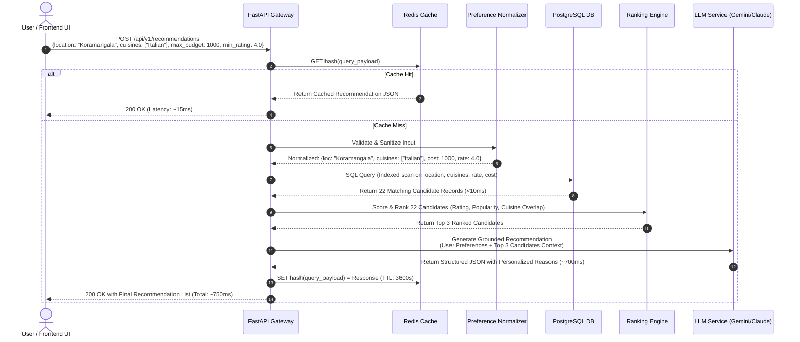

# Production-Ready System Architecture: AI-Powered Restaurant Recommendation Service

## 1. Executive Summary & Objective

This document defines the production-ready system architecture for an **AI-Powered Restaurant Recommendation Service**. 

The system enables users to input dining preferences (budget/price range, location, rating floor, and desired cuisines), filters and ranks candidate restaurants from the Zomato Bangalore dataset ([`ManikaSaini/zomato-restaurant-recommendation`](https://huggingface.co/datasets/ManikaSaini/zomato-restaurant-recommendation) on Hugging Face), and leverages a Large Language Model (LLM) to generate personalized, grounded rationales explaining why each recommended venue matches the user's specific request.

The design adheres to a **Two-Stage Retrieval & Synthesis Pattern** (Filter $\rightarrow$ Rank $\rightarrow$ Reason) to ensure:
- **Low Latency**: Sub-second end-to-end response times through indexed relational filtering.
- **Cost Efficiency**: Minimizing LLM token consumption by passing only top pre-ranked candidate restaurants.
- **Zero Hallucination**: Strict grounding constraints preventing the LLM from inventing restaurants, menus, or pricing.
- **Modularity**: Complete decoupling of data pipelines, database search, ranking math, and generation logic.

---

## 2. High-Level Architecture Diagram



---

## 3. Core Architectural Distinctions

To ensure system reliability, predictability, and cost control, the architecture strictly segregates the three recommendation responsibilities:

| Responsibility | Component | Mechanism | Operational Justification |
| :--- | :--- | :--- | :--- |
| **1. Dataset Retrieval & Filtering** | Database Layer (`PostgreSQL`) | SQL `WHERE` clauses, B-Tree indexes (`rate`, `cost`), GIN & Trigram indexes (`cuisines`, `location`). | **Speed & Cost**: Cuts 51,717 records down to 20–30 relevant candidates in <5ms without consuming expensive LLM context tokens. |
| **2. Recommendation & Ranking Logic** | Heuristic Scoring Engine (Python Service) | Deterministic composite scoring formula combining rating, popularity, cuisine overlap, and price distance. | **Consistency & Control**: Eliminates non-deterministic ordering; ensures transparent, testable, and unbiased candidate selection. |
| **3. Natural Language Reasoning** | LLM Synthesis Layer (`Gemini / Claude`) | Context-grounded synthesis with strict JSON schema and anti-hallucination prompt boundaries. | **Personalization & Engagement**: Translates dry tabular metadata into intuitive, human-centered rationales matching the user's intent. |

---

## 4. Phase-Wise Architecture Breakdown

### Phase 1: Data Ingestion
* **Objective**: Ingest the 51,717 records (~574 MB) from Hugging Face and store them immutably.
* **Source Dataset**: `ManikaSaini/zomato-restaurant-recommendation`
* **Raw Schema Fields**:
  * Identifiers & Metadata: `url`, `address`, `name`, `phone`, `listed_in(type)`, `listed_in(city)`
  * Categorical Attributes: `online_order`, `book_table`, `location`, `rest_type`, `cuisines`
  * Quantitative Attributes: `rate`, `votes`, `approx_cost(for two people)`
  * Textual Context: `dish_liked`, `reviews_list`, `menu_item`
* **Storage Strategy**:
  * An automated Python worker downloads the dataset using `datasets` / `huggingface_hub`.
  * Persisted immutably into a raw landing table (`raw_restaurants`) in PostgreSQL or compressed Parquet storage with `SHA-256` checksums and ingestion timestamps for idempotent updates.

---

### Phase 2: Data Processing & Preparation
* **Objective**: Clean messy fields, handle missing values, deduplicate listings, and build query indexes.
* **Cleaning & Normalization Rules**:
  1. **Rating (`rate`)**:
     * Raw: `"4.1/5"`, `"NEW"`, `"-"`, `NaN`.
     * Clean: Parse numeric rating float (`4.1`). For `"NEW"`, `"-"`, or missing, set `rate = NULL` and flag `is_new_restaurant = TRUE`.
  2. **Cost (`approx_cost(for two people)`)**:
     * Raw: `"800"`, `"1,200"`, `NaN`.
     * Clean: Strip commas, cast to integer (`1200`). Impute remaining nulls using the median cost of matching `(location, rest_type)`.
  3. **Cuisines (`cuisines`)**:
     * Raw: Comma-delimited text string (e.g., `"North Indian, Chinese, Fast Food"`).
     * Clean: Split into canonicalized, trimmed lowercase arrays (`text[]`), indexed with GIN.
  4. **Location (`location`, `listed_in(city)`)**:
     * Standardize casing and strip whitespace. Maintain both the specific micro-locality (e.g., `"Koramangala 5th Block"`) and the broader cluster (e.g., `"Koramangala"`).
  5. **Deduplication**:
     * The raw dataset contains duplicate restaurant entries because venues are listed across multiple delivery zones (`listed_in(city)`).
     * Deduplicate using a composite key `(name, address)` or `(name, location)`, aggregating review samples and keeping the record with the highest vote count.
* **Relational Storage Schema**:
  ```sql
  CREATE TABLE clean_restaurants (
      id UUID PRIMARY KEY DEFAULT gen_random_uuid(),
      name VARCHAR(255) NOT NULL,
      address TEXT NOT NULL,
      location VARCHAR(100) NOT NULL,
      location_cluster VARCHAR(100) NOT NULL,
      cuisines TEXT[] NOT NULL,
      cost_for_two INT NOT NULL,
      rate NUMERIC(2, 1),
      votes INT DEFAULT 0,
      rest_type VARCHAR(100),
      dish_liked TEXT[],
      sample_reviews TEXT[],
      online_order BOOLEAN DEFAULT FALSE,
      book_table BOOLEAN DEFAULT FALSE,
      is_new BOOLEAN DEFAULT FALSE,
      created_at TIMESTAMP WITH TIME ZONE DEFAULT NOW()
  );

  -- High-Performance Search Indexes
  CREATE INDEX idx_restaurants_location_trgm ON clean_restaurants USING gin (location gin_trgm_ops);
  CREATE INDEX idx_restaurants_cuisines_gin ON clean_restaurants USING gin (cuisines);
  CREATE INDEX idx_restaurants_rate_cost ON clean_restaurants (rate DESC NULLS LAST, cost_for_two ASC);
  ```

---

### Phase 3: User Preference Processing
* **Objective**: Ingest, validate, sanitize, and normalize user inputs before querying.
* **Input Schema (`UserPreferenceRequest`)**:
  * `location` (string, required): e.g., `"Koramangala"`, `"Indiranagar"`.
  * `price_range` / `max_budget` (int or enum, required): e.g., `1000` or `"MID_RANGE"`.
  * `cuisines` (list of strings, optional): e.g., `["Italian", "Pizza"]`.
  * `min_rating` (float, optional, default: `3.5`): e.g., `4.0`.
  * `dietary_or_occasion` (string, optional): e.g., `"romantic outdoor seating"`, `"veg only"`.
* **Processing Logic**:
  1. **Sanitization**: Trim whitespace, remove special characters, and lowercase strings.
  2. **Fuzzy Location Resolution**: Use Trigram similarity against known Bangalore localities to handle misspellings (e.g., `"koramangla"` $\rightarrow$ `"Koramangala"`).
  3. **Budget Tier Mapping**:
     * `BUDGET` $\rightarrow \le ₹500$
     * `MID_RANGE` $\rightarrow ₹500 - ₹1,500$
     * `PREMIUM` $\rightarrow > ₹1,500$

---

### Phase 4: Restaurant Retrieval & Recommendation Engine

This phase operates as a two-stage funnel:

```
[51,717 Processed Restaurants]
            │
            ▼  (Stage 4A: Fast SQL Hard/Soft Filter via DB Indexes)
[Top 20–30 Feasible Candidates]
            │
            ▼  (Stage 4B: Deterministic Scoring & Ranking Algorithm)
[Top 3–5 Ranked Candidates for LLM Prompt]
```

#### Step 4A: Fast Candidate Retrieval (SQL)
Executes an indexed SQL query to retrieve candidate restaurants:
```sql
SELECT id, name, location, cuisines, cost_for_two, rate, votes, rest_type, dish_liked, sample_reviews
FROM clean_restaurants
WHERE 
    (rate >= :min_rating OR rate IS NULL)
    AND cost_for_two <= :max_budget
    AND (location ILIKE '%' || :location || '%' OR location_cluster ILIKE '%' || :location || '%')
    AND cuisines && :target_cuisines
ORDER BY rate DESC NULLS LAST, votes DESC
LIMIT 30;
```
* **Fallback Relaxation Strategy**: If fewer than 3 candidates match:
  1. Relax cuisine constraint to partial/subset match.
  2. Increase budget limit by +25%.
  3. Lower minimum rating threshold by 0.3.

#### Step 4B: Multi-Factor Heuristic Ranking Engine
Computes a **Composite Match Score ($S$)** between 0.0 and 1.0 for each of the 20–30 retrieved candidates:
$$S = w_{\text{cuisine}} \cdot S_{\text{cuisine}} + w_{\text{rating}} \cdot S_{\text{rating}} + w_{\text{price}} \cdot S_{\text{price}} + w_{\text{pop}} \cdot S_{\text{pop}}$$

* **Recommended Weightings**:
  * $w_{\text{cuisine}} = 0.35$: Jaccard similarity between user cuisine list and restaurant cuisine list.
  * $w_{\text{rating}} = 0.30$: Normalized score $\frac{\text{rate}}{5.0}$.
  * $w_{\text{price}} = 0.20$: Proximity score $1.0 - \frac{|\text{cost\_for\_two} - \text{target\_budget}|}{\text{target\_budget}}$ (bounded between 0 and 1).
  * $w_{\text{pop}} = 0.15$: Popularity damping factor $\frac{\log(1 + \text{votes})}{\log(1 + \text{max\_votes})}$.
* **Selection**: The top 3 to 5 highest-scoring candidates are sliced and forwarded to the LLM.

---

### Phase 5: LLM Recommendation Layer
* **Objective**: Generate personalized, clear, and persuasive recommendations explaining *why* each restaurant matches the user's specific request.
* **Strict Anti-Hallucination Guardrails**:
  1. **Closed-World Constraint**: The LLM is instructed never to use external knowledge or invent restaurants, dishes, or prices not provided in the prompt.
  2. **Context Enclosure**: Candidate metadata is enclosed inside explicit XML tags (`<verified_restaurants>...</verified_restaurants>`).
  3. **Strict JSON Schema (Structured Outputs)**: Enforced via model `response_format` or Pydantic tool schema.
* **Prompt Template**:
  ```text
  SYSTEM PROMPT:
  You are an expert culinary concierge. You will receive a user's dining preferences 
  and a verified list of candidate restaurants retrieved from the database.

  CRITICAL CONSTRAINTS:
  1. Only recommend from the provided candidate list. Never invent or recommend external restaurants.
  2. Do not fabricate or alter any restaurant details (price, rating, location, cuisine, dishes).
  3. Base your reasoning exclusively on the provided attributes, popular dishes, and review snippets.
  4. Explain clearly and concisely (2-3 sentences) why each restaurant satisfies the user's specific preferences.

  USER PREFERENCES:
  - Location: {user_location}
  - Desired Cuisines: {user_cuisines}
  - Budget for Two: Up to ₹{user_budget}
  - Minimum Rating: {user_rating}
  - Special Occasion / Notes: {user_notes}

  VERIFIED RESTAURANT CANDIDATES:
  <verified_restaurants>
  {candidate_restaurants_json}
  </verified_restaurants>

  Respond strictly using the required JSON schema.
  ```

---

### Phase 6: API & Application Layer
* **Architecture Pattern**: Asynchronous Layered Service-Repository Pattern.
  ```
  FastAPI Router (Presentation / HTTP Transport)
       │
       ▼
  RecommendationService (Application Orchestrator)
       ├──> CacheService (Redis key-value caching)
       ├──> PreferenceNormalizer (Input validation & fuzzy matching)
       ├──> RestaurantRepository (PostgreSQL queries)
       ├──> HeuristicRankingEngine (Scoring algorithm)
       └──> LLMClient (Gemini/Claude SDK with retries & circuit breaker)
  ```
* **Endpoints**:
  * `POST /api/v1/recommendations`: Main recommendation endpoint.
  * `GET /api/v1/health`: Liveness & readiness probes for DB, Cache, and LLM APIs.
  * `GET /api/v1/metadata/filters`: Returns pre-indexed lists of locations and cuisines for frontend auto-complete.
* **Caching Strategy**: Redis caches the complete JSON response keyed by `SHA-256(normalized_query_parameters)` with a Time-To-Live (TTL) of 3,600 seconds (1 hour).

---

### Phase 7: Output Layer
* **Standardized JSON Response Contract**:
  ```json
  {
    "status": "success",
    "query_summary": {
      "location": "Koramangala",
      "cuisines": ["Italian"],
      "max_budget": 1000,
      "min_rating": 4.0
    },
    "total_candidates_found": 18,
    "recommendations": [
      {
        "restaurant_id": "9b1deb4d-3b7d-4bad-9bdd-2b0d7b3dcb6d",
        "name": "Toscano",
        "location": "Koramangala 5th Block",
        "cuisines": ["Italian", "Pizza", "Desserts"],
        "price_for_two": 900,
        "rating": 4.4,
        "votes": 1280,
        "popular_dishes": ["Ravioli", "Bruschetta", "Tiramisu"],
        "recommendation_reason": "Toscano perfectly matches your ₹1,000 budget while exceeding your 4.0 rating target with a 4.4 rating. Situated right in Koramangala 5th Block, it is celebrated for authentic wood-fired pizzas and homemade ravioli, making it an ideal Italian dining choice."
      }
    ],
    "meta": {
      "execution_time_ms": 745,
      "cached": false
    }
  }
  ```

---

### Phase 8: Deployment, Monitoring & Production Operations
* **Containerization**:
  * Multi-stage `Dockerfile` (distroless / slim Python 3.11 image) running as a non-privileged user.
  * `docker-compose.yml` for unified local/staging environments (FastAPI, PostgreSQL 16 with `pg_trgm`, Redis 7).
* **Cloud Hosting Architecture**:
  * **Option A (Container-Native Serverless)**: Google Cloud Run / AWS ECS Fargate + Managed PostgreSQL (Cloud SQL / RDS) + Managed Redis.
  * **Option B (Modular Monolith on VM)**: Single Ubuntu VM running Docker Compose with Caddy reverse proxy providing automated TLS termination.
* **Monitoring & Observability**:
  * **System Metrics**: Prometheus `/metrics` endpoint tracking request rates, P95/P99 latency, and database query durations.
  * **LLM Observability**: Integrated tracing via OpenLIT / Langfuse (recording input/output token usage, prompt latency, and cost per request).
  * **Structured Logging**: JSON logging (via Loguru or standard logging) with unique `X-Request-ID` correlation headers.
* **Security & Resilience**:
  * **Rate Limiting**: Redis-backed token bucket (`slowapi`), limiting clients to 30 requests/minute to prevent LLM quota exhaustion.
  * **Circuit Breaker & Fallback**: If the LLM provider experiences timeouts or 5xx errors, the service automatically falls back to template-based heuristic explanations without failing the user request.
  * **Secret Management**: API keys and database credentials managed strictly through environment variables and secret managers.

---

## 5. End-to-End Request Flow for a Sample Query

### Sample Query Scenario:
> **User Input**: *"Looking for a good Italian restaurant in Koramangala under ₹1000 with a rating of at least 4.0."*



---

## 6. Technology Stack Matrix

| Component | Selected Technology | Purpose & Rationale |
| :--- | :--- | :--- |
| **Backend Runtime** | Python 3.11+ | Native compatibility with ML, data science libraries, and modern LLM SDKs. |
| **Web Framework** | FastAPI + Pydantic v2 | High-throughput asynchronous routing, strict type safety, automatic OpenAPI docs. |
| **Primary Database** | PostgreSQL 16 (`pg_trgm`) | Production standard, ACID-compliant, native array filtering (`&&`) and Trigram fuzzy text matching. |
| **Caching Layer** | Redis 7 | High-performance in-memory cache to eliminate redundant LLM API costs. |
| **Data Processing** | Polars / Pandas | High-speed vectorized data cleaning and deduplication of the 574 MB raw dataset. |
| **LLM Engine** | Google Gemini 2.5 Flash / Claude 3.5 Sonnet | Cost-effective, high-speed inference, natively supports strict JSON schema structured outputs. |
| **Observability** | Prometheus, Loguru, Langfuse | Comprehensive monitoring of system latency, errors, token expenses, and model grounding. |
| **Deployment** | Docker & Docker Compose | Containerized, reproducible deployment across local, staging, and cloud environments. |

---

## 7. Implementation Roadmap & Milestones

1. **Milestone 1 (Data Foundation)**:
   - Run ingestion script to pull `ManikaSaini/zomato-restaurant-recommendation`.
   - Execute data cleaning pipeline (`clean_data.py`), handle missing values, and populate PostgreSQL.
   - Build GIN and B-Tree indexes.
2. **Milestone 2 (Core Recommendation Engine)**:
   - Implement `RestaurantRepository` with parameterized SQL filters and fallback relaxation.
   - Build and unit test the heuristic ranking formula.
3. **Milestone 3 (LLM Grounding & API)**:
   - Create Pydantic structured output models.
   - Configure LLM prompt templates and integrate the LLM SDK with structured JSON outputs.
   - Build FastAPI routes (`/api/v1/recommendations`, `/api/v1/health`).
4. **Milestone 4 (Performance, Caching & Deployment)**:
   - Integrate Redis query caching.
   - Author `Dockerfile` and `docker-compose.yml`.
   - Validate end-to-end latency and anti-hallucination guardrails.
