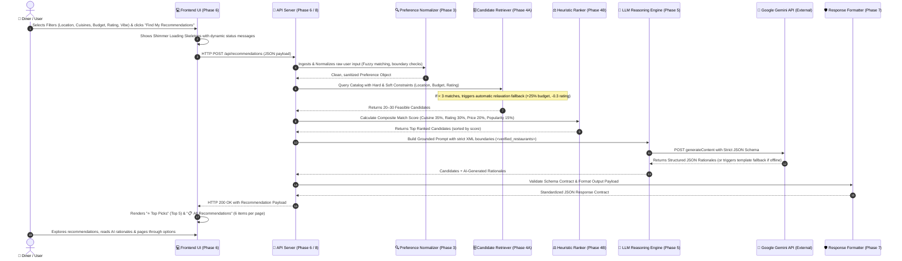

# 🍽️ AI-Powered Restaurant Recommendation Service

> An intelligent, production-ready culinary recommendation engine for Bangalore, India. Combines indexed relational filtering, deterministic heuristic ranking, and Google Gemini LLM synthesis to deliver fast, grounded, and personalized dining suggestions.

---

## 📑 Table of Contents

- [Overview](#-overview)
- [How the System Flow Works](#-how-the-system-flow-works)
  - [High-Level Flow Diagram](#high-level-flow-diagram)
  - [Step-by-Step Flow Explanation](#step-by-step-flow-explanation)
- [Phase-by-Phase Breakdown (Easy Explanation)](#-phase-by-phase-breakdown-easy-explanation)
  - [Phase 1: Data Ingestion](#phase-1-data-ingestion-phase_1)
  - [Phase 2: Data Processing & Cleaning](#phase-2-data-processing--cleaning-phase_2)
  - [Phase 3: User Preference Processing](#phase-3-user-preference-processing-phase_3)
  - [Phase 4: Retrieval & Heuristic Ranking Engine](#phase-4-retrieval--heuristic-ranking-engine-phase_4)
  - [Phase 5: LLM Reasoning & Rationale Layer](#phase-5-llm-reasoning--rationale-layer-phase_5)
  - [Phase 6: Interactive Web UI & API Server](#phase-6-interactive-web-ui--api-server-phase_6)
  - [Phase 7: Standardized Output & Contract Validation](#phase-7-standardized-output--contract-validation-phase_7)
  - [Phase 8: Cloud Database, Serverless Deployment & Vercel](#phase-8-cloud-database-serverless-deployment--vercel-phase_8)
- [API Call Reference (What APIs are Called & Why)](#-api-call-reference-what-apis-are-called--why)
  - [Internal API Endpoints](#1-internal-api-endpoints)
  - [External Third-Party APIs](#2-external-third-party-apis)
- [Database Architecture: Parquet vs Supabase / Neon](#-database-architecture-parquet-vs-supabase--neon)
- [Project Directory Structure](#-project-directory-structure)
- [Getting Started & Local Setup](#-getting-started--local-setup)
  - [Prerequisites](#prerequisites)
  - [Installation](#installation)
  - [Environment Variables Configuration](#environment-variables-configuration)
  - [Running the Web UI](#running-the-web-ui)
  - [Running Tests](#running-tests)
  - [Executing Phases Standalone](#executing-phases-standalone)
- [Deployment to Vercel](#-deployment-to-vercel)

---

## 🌟 Overview

Finding the right restaurant in a bustling culinary hub like Bangalore can be overwhelming. Generic search engines return thousands of unstructured listings with no explanation of *why* a particular restaurant fits your specific budget, taste, or occasion.

This project solves that by implementing a **Two-Stage Retrieval & Synthesis Pattern** (`Filter -> Rank -> Reason`):
1. **Filter (Phase 4A)**: Fast indexed filtering narrows down **51,700+** restaurants to **20–30** viable candidates based on location, budget, rating, and cuisine.
2. **Rank (Phase 4B)**: Deterministic heuristic scoring ranks candidates using a weighted formula (Cuisine overlap, Rating, Price distance, and Popularity votes).
3. **Reason (Phase 5)**: **Google Gemini LLM** generates personalized, human-centered rationales explaining *why* each venue matches the user's criteria with **zero hallucination** (strictly grounded in verified database attributes).
4. **Present (Phase 6)**: The frontend displays an immediate **⭐ Top Picks** view (top 5 restaurants) and an interactive **📋 All Recommendations** view with clean **6-per-page pagination**.

---

## 🔄 How the System Flow Works

### High-Level Flow Diagram



### Step-by-Step Flow Explanation

1. **User Interaction (Frontend)**:
   The diner opens the web application. By default, inputs are unselected and clean. The user selects a neighborhood (e.g., *Koramangala*), picks cuisine tags (e.g., *Italian*, *Pizza*), adjusts the budget slider (e.g., *₹1000 for two*), chooses a minimum rating (e.g., *4.0+ ★*), and optionally types a vibe note (*"cozy date night with pasta"*).

2. **Submission & Loading State**:
   When the user clicks **"Find My Recommendations ✨"**, the UI immediately transitions into a responsive loading state with animated shimmer skeletons and real-time status messages (*"Scanning 50,000+ Bangalore restaurants..."* $\rightarrow$ *"Applying budget and rating filters..."* $\rightarrow$ *"AI generating personalized recommendations..."*).

3. **Input Normalization & Sanitization (Phase 3)**:
   The server receives the request and runs it through Pydantic validators and the fuzzy normalizer. If the user typed a typo like `"koramangla"` or `"indranagar"`, it fuzzy-maps it to the canonical `"Koramangala"` or `"Indiranagar"`. It also bounds ratings between 1.0 and 5.0 and clamps budget ranges.

4. **Fast Relational Filtering (Phase 4A)**:
   The retriever searches the 51,700+ restaurant database. It filters on locality, budget ceiling, minimum rating, and cuisine tags. If a query is overly restrictive and yields fewer than 3 matches, the engine automatically applies a gentle **relaxation fallback** (expands budget by +25% and lowers rating threshold by 0.3) so the user is never left with an empty screen.

5. **Deterministic Heuristic Ranking (Phase 4B)**:
   The filtered candidates are evaluated with a multi-factor mathematical scoring model:
   - **Cuisine Match (35%)**: Jaccard similarity between user preferences and the restaurant's menu.
   - **Rating Quality (30%)**: Normalized star rating ($rate / 5.0$).
   - **Price Proximity (20%)**: Proximity to the user's budget ceiling without exceeding it.
   - **Popularity & Trust (15%)**: Log-damped review vote count to favor established, verified favorites.

6. **LLM Reasoning & Guardrailed Synthesis (Phase 5)**:
   The top ranked candidates are packaged into a structured prompt enclosed in `<verified_restaurants>` tags. **Google Gemini** receives strict instructions: *never invent restaurants or prices; base reasoning strictly on the provided dishes and attributes*. Gemini outputs structured JSON explaining why each restaurant is a match. If Gemini is unreachable or rate-limited, an automated **Template Fallback Provider** creates rich, instant rationales without breaking the user experience.

7. **Contract Validation (Phase 7)**:
   Phase 7 validates the response against strict Pydantic contract models, formats execution metadata (timestamps, total candidates found, latency in milliseconds), and prepares the output.

8. **Dual-View Rendering (Phase 6)**:
   The frontend receives the payload and renders:
   - **⭐ Top Picks**: Highlighting the first view with the top 5 highest-ranked venues.
   - **📋 All Recommendations**: Displaying all matching venues with pagination strictly capped at **6 items per page**, complete with page number buttons, previous/next controls, and dynamic AI recommendation badges.

---

## 🧩 Phase-by-Phase Breakdown (Easy Explanation)

### Phase 1: Data Ingestion (`phase_1`)
* **What it does in simple terms**: Grabs the raw Zomato Bangalore dataset containing 51,717 restaurant listings and stores it safely.
* **Source Dataset**: [`ManikaSaini/zomato-restaurant-recommendation`](https://huggingface.co/datasets/ManikaSaini/zomato-restaurant-recommendation) on Hugging Face.
* **Key Files**:
  - `phase_1/fetcher.py`: Automates dataset downloading via `huggingface_hub` with fallback to local mirror copies.
  - `phase_1/run_ingestion.py`: CLI script to execute the ingestion pipeline and verify data integrity.
  - `phase_1/config.py`: Configuration for dataset identifiers, directories, and retry limits.
* **Output**: Immutable raw data stored in `phase_1/data/raw/zomato_raw.parquet` / CSV.

---

### Phase 2: Data Processing & Cleaning (`phase_2`)
* **What it does in simple terms**: Takes messy real-world restaurant data and cleans it up so algorithms can search it in milliseconds.
* **Cleaning Transformations**:
  - **Ratings (`rate`)**: Converts raw strings like `"4.1/5"`, `"NEW"`, `"-"` into clean numeric floats (`4.1`). Flags unrated restaurants cleanly.
  - **Budget (`cost_for_two`)**: Strips commas and currency symbols (`"1,200"` $\rightarrow$ `1200`) and casts to integers. Imputes missing costs using neighborhood medians.
  - **Cuisines (`cuisines`)**: Splits messy comma-separated text into clean, trimmed lowercase lists (e.g., `["north indian", "chinese", "fast food"]`).
  - **Locations**: Standardizes spelling and links micro-localities (`"Koramangala 5th Block"`) to overarching clusters (`"Koramangala"`).
  - **Deduplication**: Zomato lists the same restaurant multiple times for different delivery zones; Phase 2 deduplicates by `(name, address)`, retaining the record with the most votes.
* **Key Files**:
  - `phase_2/cleaner.py`: Core cleaning, imputation, and deduplication logic using Pandas.
  - `phase_2/run_processing.py`: Command-line execution script.
* **Output**: High-speed, indexed catalog saved at `phase_2/data/processed/clean_restaurants.parquet`.

---

### Phase 3: User Preference Processing (`phase_3`)
* **What it does in simple terms**: Acts as the intelligent receptionist. It listens to what the user asks for, fixes spelling mistakes, and packages their request into a clean format.
* **Key Capabilities**:
  - **Fuzzy Location Resolution**: Uses sequence matching to map typos like `"koramangla"` or `"indranagr"` to canonical Bangalore localities.
  - **Cuisine Parsing**: Handles comma-separated strings or arrays, matching them against known culinary taxonomy.
  - **Input Validation**: Ensures budget is positive, rating is within 1.0–5.0, and bounds strings using Pydantic schemas.
* **Key Files**:
  - `phase_3/models.py`: Pydantic data schemas (`UserPreferenceInput`, `NormalizedPreference`).
  - `phase_3/normalizer.py`: Text normalization, fuzzy matching, and default fallback handling.
  - `phase_3/run_preference.py`: Standalone CLI testing script.

---

### Phase 4: Retrieval & Heuristic Ranking Engine (`phase_4`)
* **What it does in simple terms**: The brains of candidate selection. First it filters the database down to matching restaurants, then it scores them to pick the absolute best ones.
* **Two-Step Architecture**:
  - **Step 4A: Retrieval Engine (`retriever.py`)**: Filters 51,700+ rows down to 20–30 candidates based on hard constraints (location, budget ceiling, minimum rating). If zero or too few restaurants match, it applies smart constraint relaxation (+25% budget, -0.3 rating).
  - **Step 4B: Heuristic Ranking Engine (`ranker.py`)**: Computes a deterministic Composite Score:
    $$\text{Score} = 0.35 \times \text{Cuisine} + 0.30 \times \text{Rating} + 0.20 \times \text{Price} + 0.15 \times \text{Popularity}$$
* **Key Files**:
  - `phase_4/retriever.py`: High-speed candidate filtering with auto-relaxation.
  - `phase_4/ranker.py`: Multi-factor heuristic scoring algorithm.
  - `phase_4/engine.py`: Unified facade connecting Phase 3 normalizer, retriever, and ranker.

---

### Phase 5: LLM Reasoning & Rationale Layer (`phase_5`)
* **What it does in simple terms**: The AI culinary concierge. It takes the top ranked restaurants and writes conversational, persuasive explanations of *why* each venue is perfect for the user's specific request.
* **Anti-Hallucination Guardrails**:
  - **Closed-World Constraint**: Gemini is explicitly instructed never to invent restaurants, dishes, or prices not in the verified candidate list.
  - **XML Context Tagging**: Candidate data is passed inside `<verified_restaurants>` tags.
  - **Structured JSON Output**: Uses Gemini's native structured outputs (`response_mime_type="application/json"`) with a strict Pydantic JSON schema.
  - **Graceful Failover**: If the Gemini API key is missing or quota is exhausted, it automatically falls back to the deterministic `TemplateFallbackProvider` so the UI never crashes.
* **Key Files**:
  - `phase_5/generator.py`: Orchestrates prompt construction, LLM calls, and provider dispatch (`GeminiProvider`, `TemplateFallbackProvider`, `DeterministicMockProvider`).
  - `phase_5/prompt.py`: Prompt templates with guardrail constraints.
  - `phase_5/guardrails.py`: Output sanitization and candidate verification validator.

---

### Phase 6: Interactive Web UI & API Server (`phase_6`)
* **What it does in simple terms**: The interactive user interface and local web server that brings everything to life in the browser.
* **Frontend Features**:
  - **Quick Location Chips**: Instant buttons for Bangalore hotspots (*Koramangala, Indiranagar, HSR Layout, Whitefield, MG Road, Jayanagar*).
  - **Interactive Budget Slider**: Live slider with dynamic ₹ badges from ₹200 to ₹4,000+.
  - **Multi-Select Cuisine Badges**: Clickable emoji pills (*🍕 Italian, 🍛 North Indian, 🥢 Chinese, 🥘 Biryani, ☕ Cafe, etc.*).
  - **Loading Shimmer Skeletons**: Displays elegant animated cards while querying.
  - **Dual-View Layout**:
    - **⭐ Top Picks**: Prominently shows the top 5 highest-scored options on initial view.
    - **📋 All Recommendations**: Tabular/grid display showing all candidates with clean **6 items per page** pagination.
  - **AI Rationale Badges**: Glowing AI badges on every card explaining the personalized match.
* **Key Files**:
  - `phase_6/server.py`: Lightweight HTTP server with threading support, serving both API and static files.
  - `phase_6/api.py`: Route controller and schema validation for HTTP requests.
  - `phase_6/templates/index.html`: Modern semantic HTML5 markup.
  - `phase_6/static/js/app.js`: Reactive clientside logic, pagination manager, and API client.
  - `phase_6/static/css/style.css`: Modern glassmorphism CSS design system with CSS custom properties.

---

### Phase 7: Standardized Output & Contract Validation (`phase_7`)
* **What it does in simple terms**: The quality assurance inspector. Ensures every response leaving the backend adheres to an exact, agreed-upon JSON schema contract before reaching the frontend or external clients.
* **Contract Features**:
  - Standardized JSON envelope: `status`, `query_summary`, `total_candidates_found`, `recommendations`, `meta`.
  - Type-safe schema validation using Pydantic v2.
  - Captures execution metrics (`execution_time_ms`, timestamp, LLM provider used).
* **Key Files**:
  - `phase_7/contracts.py`: Canonical Pydantic models (`RecommendationResponseEnvelope`, `RestaurantRecommendationItem`).
  - `phase_7/validator.py`: Contract validation and schema compliance checkers.
  - `phase_7/formatter.py`: Converts raw Phase 5 output into Phase 7 contract envelopes.

---

### Phase 8: Cloud Database, Serverless Deployment & Vercel (`phase_8`)
* **What it does in simple terms**: Everything needed to deploy the system to Vercel and connect it to a cloud database (like Supabase or Neon).
* **Key Capabilities**:
  - **Vercel Serverless Functions**: Native serverless handlers (`api/recommendations.py`, `api/health.py`, `api/metadata.py`) with a 15-second execution timeout guardrail.
  - **PostgreSQL Database Schema (`schema.sql`)**: PostgreSQL DDL schema with GIN indexes on cuisines and Trigram indexes on locations.
  - **Database Migration (`db_migration.py`)**: Script to upload the cleaned Parquet dataset into a remote Supabase or Neon PostgreSQL instance.
  - **Pre-Deployment Health Check (`run_deployment_check.py`)**: Automated verification testing environment variables, catalog accessibility, and API contracts.

---

## 📡 API Call Reference (What APIs are Called & Why)

### 1. Internal API Endpoints

These are the REST endpoints hosted by the service (`phase_6/server.py` locally and `phase_8/api/` on Vercel):

| Endpoint | HTTP Method | What It Is Called For | Request Payload | Response Data |
| :--- | :---: | :--- | :--- | :--- |
| `/api/recommendations` | `POST` | Primary recommendation endpoint. Orchestrates Phase 3 $\rightarrow$ 4 $\rightarrow$ 5 $\rightarrow$ 7. | `{"location": "Koramangala", "cuisines": ["Italian"], "max_budget": 1000, "min_rating": 4.0, "vibe_or_notes": "quiet dinner", "top_k": 30}` | Standardized Phase 7 JSON envelope with ranked restaurant cards, popular dishes, and Gemini AI rationales. |
| `/api/metadata` | `GET` | Called by frontend upon loading to dynamically populate location buttons, cuisine pills, and slider budget bounds. | *None* | `{"popular_locations": [...], "popular_cuisines": [...], "default_budget": 1000, "min_budget": 200, "max_budget": 4000}` |
| `/api/health` | `GET` | Monitoring & deployment health check. Confirms service status and catalog size. | *None* | `{"status": "healthy", "service": "AI-Restaurant-Recommendation-API", "catalog_size": 51717, "version": "1.0.0"}` |

---

### 2. External Third-Party APIs

The system communicates with the following external APIs:

| External Service | Library / SDK Used | When It Is Called | Purpose & Operation | Failover Behavior |
| :--- | :--- | :--- | :--- | :--- |
| **Google Gemini API** (`gemini-2.5-flash` / `gemini-1.5-flash`) | `google-genai` SDK | Called during **Phase 5** when generating personalized recommendations. | Receives user preferences + verified restaurant candidate metadata. Synthesizes a natural language rationale explaining why each restaurant fits the user's specific request. | **Automatic Failover**: If `GEMINI_API_KEY` is missing or quota is exhausted, falls back seamlessly to `TemplateFallbackProvider` (rule-based rationale synthesis). |
| **Hugging Face Hub API** | `huggingface_hub` / `datasets` | Called during **Phase 1** (One-time batch ETL). | Downloads the raw 51,717 restaurant records (`ManikaSaini/zomato-restaurant-recommendation`). | Falls back to local cached files or pre-packaged mirrors. |
| **Cloud PostgreSQL API** *(Optional)* | `psycopg2` / `@neondatabase/serverless` | Called during **Phase 4A** (Candidate Retrieval) if `DATABASE_URL` is set. | Executes fast indexed SQL queries (`ILIKE`, GIN `&&` cuisine overlap) against Supabase or Neon PostgreSQL. | **Automatic Fallback**: If no database URL is provided, the engine queries the local `clean_restaurants.parquet` file in-memory using vectorized Pandas/PyArrow. |

---

## 💾 Database Architecture: Parquet vs Supabase / Neon

A common question is: *Is a cloud database like Supabase or Neon required, or can the app work without it?*

### The Difference:

| Feature | Standalone Mode (In-Memory Parquet) | Cloud Database Mode (Supabase / Neon) |
| :--- | :--- | :--- |
| **Setup Needed** | **Zero setup**. Works out of the box immediately. | Requires creating a Supabase/Neon project and running `db_migration.py`. |
| **Data Storage** | `phase_2/data/processed/clean_restaurants.parquet` | Remote PostgreSQL table (`clean_restaurants`). |
| **Filtering Speed** | **< 15 ms** (Vectorized Pandas filtering in RAM). | **< 10 ms** (Indexed SQL query with B-Tree & GIN). |
| **Cold Starts** | Lightweight (<1 second initialization). | Relies on pooled connections (`pgbouncer`). |
| **Best Used For** | **Local development, offline testing, lightweight Vercel serverless functions.** | **Multi-tenant enterprise apps, frequent real-time menu updates, dynamic user bookmarking.** |

> **Conclusion**: The application is **100% self-contained and fully functional without an external database**. If `DATABASE_URL` is not provided in `.env`, the system automatically uses the high-performance local Parquet dataset.

---

## 📁 Project Directory Structure

```text
restaurant_recomendation/
├── .env                       # Local environment variables (GEMINI_API_KEY, etc.)
├── .env.example               # Template environment variables
├── .gitignore                 # Excludes raw data caches, virtualenvs, secrets
├── pyproject.toml             # Project build configuration
├── requirements.txt           # Python package dependencies
├── vercel.json                # Vercel deployment and routing configuration
├── README.md                  # Comprehensive project documentation
├── ARCHITECTURE.md            # Detailed engineering architecture specification
│
├── phase_1/                   # Phase 1: Data Ingestion
│   ├── config.py              # Ingestion settings & Hugging Face dataset IDs
│   ├── fetcher.py             # Hugging Face downloader with fallback
│   ├── run_ingestion.py       # Batch ETL runner
│   └── tests/                 # Unit tests for Phase 1
│
├── phase_2/                   # Phase 2: Data Cleaning & Processing
│   ├── cleaner.py             # Cleaning, imputation, and deduplication logic
│   ├── config.py              # Output paths & column definitions
│   ├── run_processing.py      # Cleaning pipeline execution script
│   └── data/processed/        # Cleaned dataset (clean_restaurants.parquet)
│
├── phase_3/                   # Phase 3: User Preference Processing
│   ├── models.py              # Pydantic schemas (UserPreferenceInput, etc.)
│   ├── normalizer.py          # Fuzzy location matching & bounds checking
│   └── run_preference.py      # Preference CLI test runner
│
├── phase_4/                   # Phase 4: Retrieval & Heuristic Ranking
│   ├── retriever.py           # SQL/Parquet candidate filter with auto-relaxation
│   ├── ranker.py              # Multi-factor composite heuristic scorer
│   ├── engine.py              # Unified recommendation facade
│   └── models.py              # Candidate & scored restaurant models
│
├── phase_5/                   # Phase 5: LLM Reasoning & Rationale Layer
│   ├── generator.py           # Gemini SDK integration & fallback handlers
│   ├── prompt.py              # Anti-hallucination prompt templates
│   ├── guardrails.py          # Output verification & constraint validation
│   └── config.py              # Model selection (gemini-2.5-flash) & token limits
│
├── phase_6/                   # Phase 6: Interactive Web UI & API Server
│   ├── server.py              # Multi-threaded local Python HTTP server
│   ├── api.py                 # REST route handlers & schema validation
│   ├── templates/             # HTML5 templates (index.html)
│   └── static/                # CSS styling, animations, and clientside JS
│       ├── css/style.css      # Glassmorphism UI styling
│       └── js/app.js          # Interactive UI logic & pagination (6/page)
│
├── phase_7/                   # Phase 7: Standardized Output & Contracts
│   ├── contracts.py           # Standardized JSON response contract models
│   ├── formatter.py           # Serializer transforming Phase 5 to Phase 7
│   ├── validator.py           # Schema compliance checker
│   └── service.py             # High-level output validation service
│
└── phase_8/                   # Phase 8: Cloud DB & Vercel Serverless
    ├── api/                   # Vercel serverless Python functions
    │   ├── recommendations.py # Serverless POST /api/recommendations
    │   ├── health.py          # Serverless GET /api/health
    │   └── metadata.py        # Serverless GET /api/metadata
    ├── schema.sql             # PostgreSQL DDL with GIN & Trigram indexes
    ├── db_migration.py        # Supabase/Neon PostgreSQL ingestion script
    └── run_deployment_check.py# Pre-flight deployment health check
```

---

## 🚀 Getting Started & Local Setup

### Prerequisites

- **Python**: Python 3.10, 3.11, 3.12, or 3.13
- **Google Gemini API Key**: Get a free key at [Google AI Studio](https://aistudio.google.com/) *(optional; app will use template fallback if omitted)*.

---

### Installation

1. **Clone the repository**:
   ```bash
   git clone https://github.com/piyushbakade/restaurant_recomendation.git
   cd restaurant_recomendation
   ```

2. **Create and activate a virtual environment**:
   ```bash
   # Windows (PowerShell)
   python -m venv .venv
   .\.venv\Scripts\Activate.ps1

   # macOS / Linux
   python3 -m venv .venv
   source .venv/bin/activate
   ```

3. **Install dependencies**:
   ```bash
   pip install -r requirements.txt
   ```

---

### Environment Variables Configuration

Create a `.env` file in the root directory (you can copy `.env.example`):

```bash
cp .env.example .env
```

Edit `.env` with your credentials:

```ini
# Google Gemini API Key for AI Rationales (Phase 5)
GEMINI_API_KEY=your_gemini_api_key_here
GEMINI_MODEL=gemini-2.5-flash

# Optional: Remote PostgreSQL (Supabase or Neon). Leave blank to use fast local Parquet.
DATABASE_URL=

# Server Configuration
PORT=8000
HOST=127.0.0.1
DEBUG=True
```

---

### Running the Web UI

Launch the local web server:

```bash
python phase_6/server.py
```

Open your browser and navigate to:
```text
http://localhost:8000/
```

- Select a location (or click a quick chip like **Koramangala**).
- Pick your desired cuisines (e.g., **Italian**, **Pizza**).
- Adjust the budget slider to your target price for two.
- Select your minimum rating floor (e.g., **4.0+ ★**).
- Click **"Find My Recommendations ✨"**.

---

### Running Tests

The test suite contains **102 comprehensive automated tests** covering all 8 phases:

```bash
# Run the complete test suite
pytest -q

# Run tests with detailed verbosity
pytest -v

# Run tests for a specific phase (e.g., Phase 5)
pytest phase_5/tests/ -v
```

---

### Executing Phases Standalone

Each phase can be inspected or run individually:

```bash
# Phase 1: Ingest raw data
python phase_1/run_ingestion.py

# Phase 2: Clean and preprocess data
python phase_2/run_processing.py

# Phase 3: Test user preference normalization
python phase_3/run_preference.py

# Phase 4: Test candidate retrieval & heuristic ranking
python phase_4/run_recommendation.py

# Phase 5: Test Gemini LLM prompt generation & guardrails
python phase_5/run_generation.py

# Phase 7: Test standardized contract output
python phase_7/run_output.py

# Phase 8: Run pre-deployment verification
python phase_8/run_deployment_check.py
```

---

## ☁️ Deployment to Vercel

The project is structured to deploy smoothly to **Vercel** as a serverless web application:

1. **Push your code to GitHub**:
   ```bash
   git add -A
   git commit -m "feat: complete production-ready recommendation service"
   git push origin main
   ```

2. **Import into Vercel**:
   - Log in to [Vercel](https://vercel.com/) and click **"Add New Project"**.
   - Select your `restaurant_recomendation` GitHub repository.
   - Configure Environment Variables in the Vercel dashboard:
     - `GEMINI_API_KEY`: Your Google Gemini API Key.
     - `DATABASE_URL`: *(Optional)* Your Supabase/Neon connection string.

3. **Deploy**:
   - Click **Deploy**. Vercel will build the frontend and deploy the Python serverless functions at `/api/recommendations`, `/api/health`, and `/api/metadata`.

---

## 📄 License & Attribution

- **Dataset**: [Zomato Bangalore Restaurants Dataset](https://huggingface.co/datasets/ManikaSaini/zomato-restaurant-recommendation) by Manika Saini on Hugging Face.
- **LLM Reasoning**: Powered by Google DeepMind's Gemini API via `google-genai`.
